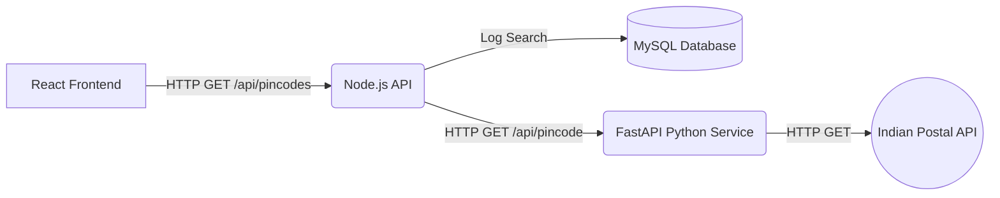

# Pincode Explorer 


Pincode Explorer is a robust, full-stack microservices application designed to fetch and display detailed postal code information for locations across India. It leverages a modern tech stack to ensure high performance, separation of concerns, and resilient external API communication.

---

##  Features

* **Real-time Search:** Search for any 6-digit Indian postal code to instantly retrieve details.
* **Resilient Architecture:** Microservice design handles external API instability gracefully. If the third-party postal API is down, the system provides mock fallback data rather than crashing.
* **Search History Logging:** Every search is asynchronously logged to a MySQL database via the Node.js orchestrator.
* **Modern UI:** Built with React and Vite for a fast, responsive, and clean user experience.

---

##  Architecture

The project is split into four distinct layers:

1. **Frontend (`/frontend`)**: A React application built with Vite. It handles the UI, state management, and makes API calls to the Node.js backend using Axios.
2. **Main Backend (`/backend-node`)**: An Express server acting as the primary orchestration API. It receives requests from the frontend, logs the history to MySQL, and forwards the data request to the Python microservice.
3. **Data Service (`/backend-python`)**: A Python FastAPI service dedicated solely to communicating with the external Indian Postal API. It parses the data and returns it to the Node backend.
4. **Database (`/database`)**: A MySQL database used to store the persistent search history of the users.



---

##  Tech Stack

* **Frontend:** React 18, Vite, CSS3
* **Node Backend:** Node.js, Express, Axios, MySQL2
* **Python Service:** Python 3.x, FastAPI, Uvicorn, Requests
* **Database:** MySQL

---

##  Getting Started

Follow these instructions to get a copy of the project up and running on your local machine.

### Prerequisites

* [Node.js](https://nodejs.org/) (v16 or higher)
* [Python](https://www.python.org/) (v3.8 or higher)
* [MySQL Server](https://dev.mysql.com/downloads/)

### 1. Database Setup
1. Open your MySQL client (like MySQL Workbench).
2. Run the `database/schema.sql` script to create the `pincode_explorer` database and the `search_history` table.
3. (Optional) Run `database/seed.sql` to populate some dummy initial data.
4. Update your MySQL password in the `backend-node/.env` file.

### 2. Start the Python Data Service
Open a terminal and run the following commands:
```bash
cd backend-python
pip install -r requirements.txt
uvicorn app.main:app --reload --port 8000
```

### 3. Start the Node.js Orchestrator
Open a **second** terminal and run:
```bash
cd backend-node
npm install
npm run dev
```

### 4. Start the React Frontend
Open a **third** terminal and run:
```bash
cd frontend
npm install
npm run dev
```

Once all services are running, open your browser and navigate to the local URL provided by the Vite server (usually `http://localhost:5173`).

---

## 📂 Project Structure

```text
pincode-explorer/
├── frontend/               # React UI
│   ├── src/
│   │   ├── components/     # Reusable UI components
│   │   ├── pages/          # Application views
│   │   └── services/       # Axios API handlers
├── backend-node/           # Main Node.js API
│   ├── controllers/        # Route logic
│   ├── routes/             # Express routers
│   └── services/           # DB & Python communication
├── backend-python/         # External API Microservice
│   ├── app/
│   │   ├── routes/         # FastAPI endpoints
│   │   └── services/       # External requests
└── database/               # SQL Scripts
```

---

##  License

This project is licensed under the MIT License - see the [LICENSE](LICENSE) file for details.
